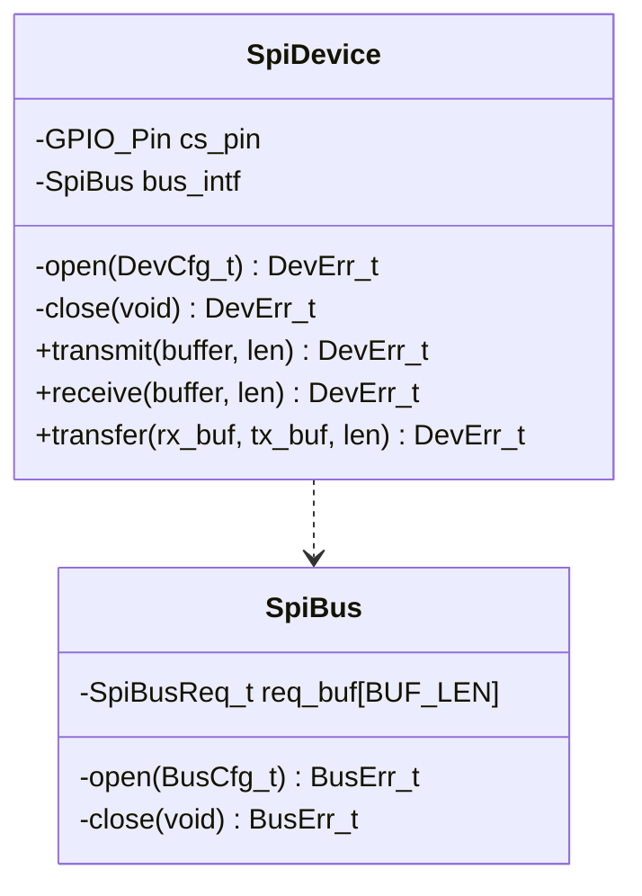

# Layered SPI 

Goal: Demonstrate implementation of SPI driver with architecture such that multiple clients may exist on a bus and submit transactions requests. 

## Aspects

* GitHub repository with clean commits
* GitHub pipeline for CI/CD testing
    * Build
    * Unit Test (with Gtest) 
    * Package? 
* Driver Code
    * Utilize dependency injection for HAL API vs testing stub
    * Interface definition for Bus layer and Middleware (Client) layer
    * Middleware layer queuing transactions from multiple tasks on a single SPI bus
* Hardware Testing
    * SPI loopback testing (tie MISO MOSI lines)

## Driver Architecture

### SPI Layers

